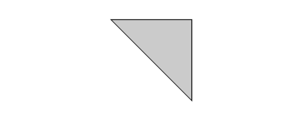
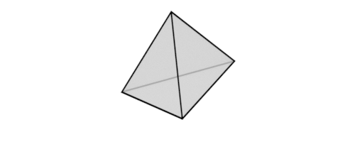
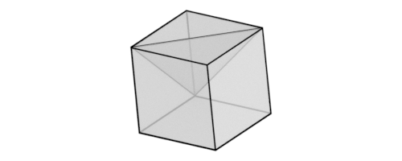

Here we will look at a generalization of graph theory. All visualizations were made in Blender3D.

There are many ways to generalize graph theory. One way is with the "hypergraph", which in essence is a graph where edges can connect to more than $2$ vertices. This is easy to visualize if we imagine edges as being able to "branch". A bit of imagination can lead us to other generalizations, and here I present one I came up with that motivates the rich theory of CW complexes.

<!--more-->

<h2>Generalizing Finite, Connected Planar Graphs and Euler's Theorem</h2>
In particular, let us try to generalize connected simple planar graphs, because they are quite "nice". Firstly, they are graphs, but they are also fundamentally geometric, as planar graphs are those that can be embedded in the plane. We will extend two theorems: firstly, connected simple planar graphs have the property (Euler's Theorem) that, if $v$, $e$, $f$ be the number of vertices, edges and faces respectively.

Euler's Theorem: If a finite, connected planar graph is drawn in the plane without edge intersections, then

$$v-e+f=2$$

Secondly, planar graphs can be embedded onto the plane without any edges intersecting. In fact, note how neither vertices, edges nor faces intersect other vertices, edges or faces respectively. In fact(!), note how—if we identify vertices as points, edges as lines and faces as bounded open sets filling in the space between edges (polygons)—neither points, edges or faces intersect other points, edges or faces.

Euler's Theorem is a little misleading as it stands now because I haven't quite defined what constitutes a "face". In particular, for graphs that can be embedded into a bounded subset of the plane, we still take the "outside" of the graph to be counted as a face. We shall see, rather surprisingly, that in the generalization here it is maybe more elegant to say that the "outside" does not constitute a face and that $v-e+f=1$. You can check this for the triangle below:

In fact, there is a lot to be tightly, mathematically formulated. But this is not necessary, because I only want to illustrate the ideas involved in generalizing planar graphs.

The first thing to note is that connected simple planar graphs are, well, planar. That is, they are clearly embedded into the 2D plane, i.e. 2D euclidean space. We might expect a generalization to be 3-dimensional. The obvious generalization is what computer scientists call a polygon mesh, which intuitively can be viewed as a volume whose boundary is a set of poylgons (though this does not rule out pathological cases). Examples are, of course, polyhedra, but also complicated volumes that have been, as they say, triangulated. Indeed we shall go with polygonal meshes.

Now we notice how a polygonal mesh "glues" to another polygonal mesh; it is quite clear it can be glued by a face. Let's go with that idea, because in the planar graphs we have discussed a face can be glued to a face by an edge, and an edge can be glued to an edge by a vertex. Furthermore, we don't necessarily disallow gluing faces together by vertices; for this reason we can glue polygonal meshes by vertices, or edges as well. This is very elegant.

For the sake of brevity, let us call the generalization of a "face" a "room". The following shape has $1$ room, $4$ faces, $6$ edges and $4$ vertices.

The following more complicated shape has $2$ rooms, $10$ faces, $15$ edges and $8$ vertices. Note how, when two rooms are glued together, they share <i>one</i> face, not two faces.

Now, let us try to generalize Euler's formula. We will, for simplicity, disregard the face "outside" the shape, so that for simply connected planar graphs $V-E+F=1$. If a generalization for the planar case exist to higher dimensions, then we might expect the existence also of a "reduction" to lower dimensions. In $d=1$, we have a graph that we may draw on a line. The rules are: (1) we may draw a vertex or an edge and (2) edges and vertices may not intersect other edges and vertices. Furthermore, we shall not take the "outside" part as an edge. The reader can convince him/herself that such graphs satisfy $V-E=1$. If we had taken the "outside" as an edge, we would have $V-E=0$. Now let's go zero-dimensional. We have a euclidean space that consists of a single point. This point can be the vertex, but no edges can be added (because they are one-dimensional) and no additional vertices (because (1) vertices would intersect and (2) there would be no edges connecting them). Clearly Euler's formula is then $V=1$.

So we have seen that Euler's formula for $n=0$, $1$, $2$ is $V=1$, $V-E=1$ and $V-E+F=1$. There is a clear pattern, and let us conjecture that in 3D $V-E+F-R=1$ where $R$ is the number of "rooms".

Looking at the two 3D shapes given, we indeed find that $V-E+F-R=1$ in both cases(!). It seems like we have found a valid generalization of Euler's formula, and this is indeed the case.

# CW-Complexes
We will see that the above discussion ties in very naturally with an accepted generalization of graphs, namely CW-complexes. These are more abstract, topological objects that generalize the hierarchy of vertices, edges, faces and so on, with rules prescribing how they are combined. The complex is then the graph. The definition is particularly simple in the case of finite graphs. CW-complexes are made from $n$-cells, so let's first define those. We work in a topological space $X$.

**Definition**: An $n$-cell is a space homeomorphic to the open $n$-disk $int(D^{n})$. A cell is a space which is an $n$-cell for some $n \geq 0$.

Here we define $D^{n} = \left \\{ x \in \mathbb{R}: \left \| x \right \| \leq 1 \right \\}$. The $n$-cell aims to generalize vertices, edges, faces and so on. It's quite clear how this works. Note that we can talk about <i>the</i> dimension of an $n$-cell, because $int(D^{n})$ and $int(D^{m})$ are homeomorphic iff $n=m$. Too understand the connection of $n$-cells with $n-1$-cells we need to define the boundary of the $n$-dimensional disk. We define it as $S^{n-1} = \left \\{ x \in \mathbb{R}: \left \| x \right \| = 1 \right \\}$. We also need the convention $D^{0}={0}$. This is of course homeomorphic to a point in space; namely a vertex.

**Definition**: A cell-decomposition of a space $X$ is a family $\mathcal{E} = \left \\{ e_{\alpha} : \alpha \in I \right \\}$ (where $I$ is an index) of subspaces of $X$ such that each $e_{\alpha}$ is a cell and

$$X = \coprod_{\alpha \in I} e_{\alpha}$$

(<i>disjoint</i> union). The $n$-skeleton of $X$ is the subspace

$$X^{n} = \coprod_{\alpha \in I : dim(e_{\alpha}) \leq n} e_{\alpha}$$

Think of the $n$-skeleton as housing all the $n$-cells, $n-1$ cells, and so on. For the 3D meshes from earlier, $X^{2}$ would be a wireframe including edges and vertices, but not faces.

**Definition**: A pair $\left ( X, \mathcal{E} \right )$ consisting of a Hausdorff space $X$ and a cell-decomposition $\mathcal{E}$ of $X$ is called a CW-complex if the following $3$ axioms hold:

1. \- ('Characteristic Maps') For each $n$-cell $e \in \mathcal{E}$ there is a map $\Phi_{e} : D^{n} \rightarrow X$ restricting to a homeomorphism $\Phi_{e} \|_{int(D^{n})} \rightarrow e$ and taking $S^{n-1}$ into $X^{n-1}$.

2. \- ('Closure Finiteness') For any cell $e \in \mathcal{E}$ the closure $\overline{e}$ intersects only a finite number of other cells in $\mathcal{E}$.

3. \- ('Weak Topology') A subset $A \subseteq X$ is closed iff $A \cap \overline(e)$ is closed in $X$ for each $e \in \mathcal{E}$.

Intuitively the first axiom tells us two things: (1) that each cell can be built from the $n$-disk, should we allow continuously deforming it into $X$, and (2) that the boundary of such a cell is restricted to $X^{n-1}$. The first part intuitively captures the natural progression from points, to curves, to surfaces, to volumes that we have seen in graphs. The second part, based on our previous discussion, says that faces have boundaries that contain vertices and edges, but NOT "rooms". In graph theory we would naturally not define the boundary of an edge to be a face; it makes much more sense for it to be a vertex—to go down a dimension. This is captured here. Furthermore, this tacitly embodies the idea that graphs are made from "gluing" together different components.

The second axiom is more subtle, and rules out pathological cases (for instance edges made up of infinitely many vertices). The same can be said of the third axiom, and in fact they are both superfluous if $\mathcal{E}$ is finite i.e. there are a finite number of cells. We are only concerned with finite complexes.

The generalization we sought to find was that of the Euler characteristic for finitely many cells. We define the Euler characteristic of a finite CW complex as:

$$\chi = k_{0} - k_{1} + k_{2}...$$

Where $k_{n}$ are the number of $n$-cells. In the 3D case, the Euler characteristic is analoguous to the number of "holes" in a complex. In our discussion, as we have seen, we would correctly expect the Euler characteristic of $S^{n}$ to equal $1 + (-1)^{n}$ (here we also take the "outside" of the sphere as an $n$-cell, because it is included in the space $X$).

To end with, there is another generalization of the graph slightly weaker the notion of CW-complexes; namely that of the simplicial complex. Here graphs are made up of mathematical simplexes, where an $n$-dimensional simplex consists of $n+1$ points. In the mathematical literature, the simplex of the highest dimension is called a chamber. Words like "apartment" and "building" also come up in this theory, which I find very neat. In three dimensions, we can imagine ourselves inside a large cube (atrium) with twelve doors to different corridors (edges), and in the corners a total of six more doors to smaller rooms (vertices). Going into a corridor, we can see it stretch left and right between two opposite doors, leading again to the aforementioned rooms. This is, of course, a cube! Neat, huh?

<h1>References</h1>

- Soren Hansen. <i>CW Complexes</i>. (Lecture Notes, Kansas State University)

- Gowers, Timothy, June Barrow-Green, and Imre Leader. 2008. <i>The Princeton Companion to Mathematics</i>. Princeton, N.J.: Princeton University Press.